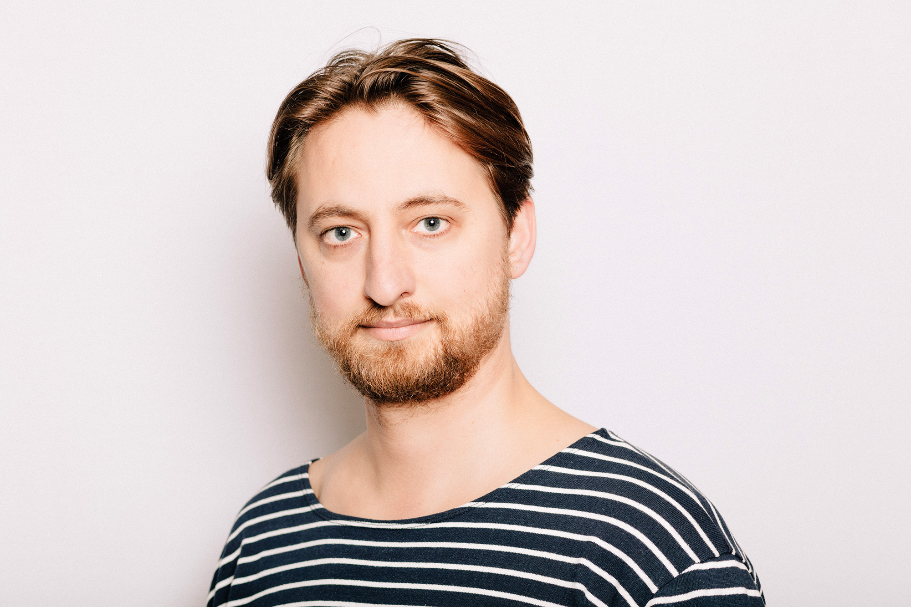

---
# Feel free to add content and custom Front Matter to this file.
# To modify the layout, see https://jekyllrb.com/docs/themes/#overriding-theme-defaults

layout: home
---

 

My name is <b>Rory Harder</b>, and this is my personal academic website.

As of September 2025, I am a postdoctoral fellow at the Collège de France as a part of François Recanati's <a href="https://sites.google.com/view/ercmentalfiles/home">project on mental files</a>. Before that I did a postdoctoral fellowship at University College Dublin, and before that I did my PhD in philosophy at the University of Toronto.

I like taking film <a href="https://500px.com/p/roryharder?view=photos">photographs</a>.

<a href="rh-cv.pdf">Here</a> is my CV.

You can e-mail me at [myfirstname][mylastname]@gmail.com.

See more about my <a href="research">research</a> and <a href="teaching">teaching</a>.
